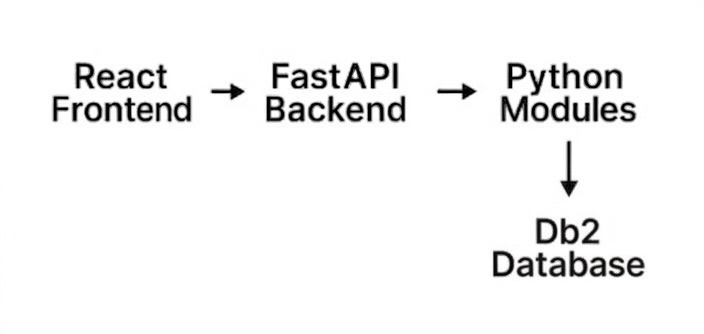

# Getting started with Spellstack API

Spellstack API provides a RESTful interface for integration clients to interact with the Spellstack backend. Spellstack API is designed to be simple and intuitive for developers familiar with standard REST conventions. There are no special authentication requirements or custom headers needed to work with the API. All endpoints expect and return JSON-formatted data.

All requests and responses use `application/json` as the content type. CORS is enabled for the frontend development origin at `http://localhost:3000`, allowing the client application to communicate with the API without cross-origin restrictions during local development. The API does not require authentication and all documented endpoints are accessible without credentials or tokens.

**Base URL for the API**  

`http://localhost:8000`

## Architecture

Spellstack uses a layered architecture where the frontend client communicates with the backend API, and the API coordinates business logic, inventory data, and purchase workflows. The diagram below provides a high-level view of the primary components and their interactions.

